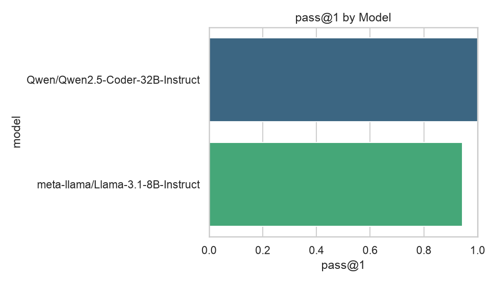
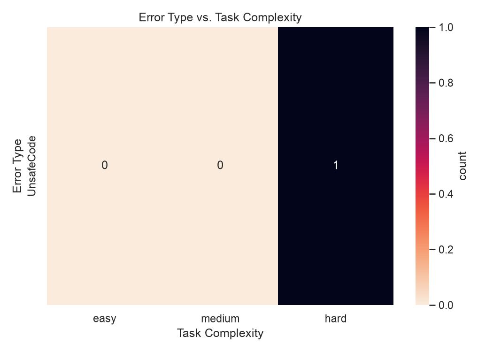

# llm-vibe-coding-evaluator

[](https://github.com/yryssqq/llm-vibe-coding-evaluator/actions/workflows/ci.yml)

## Abstract

"Vibe coding" — accepting LLM-generated code with little or no review — trades engineering rigor for speed. The risk is qualitative in most discussions: hallucinated APIs, silent logic errors, unsafe operations. This is an automated benchmarking pipeline that turns that risk into a measurable experiment. It runs a fixed benchmark of algorithmic tasks through multiple LLMs, executes every generated solution in an isolated sandbox, and reports correctness (pass@1), failure modes, and how often a model reaches for filesystem/network/`eval` access it was never asked to use.

Written alongside my article, *Vibe Coding and the Future of Software Development: Benefits, Risks, and Educational Implications* (Curieux Academic Journal, p. 155): https://www.curieuxacademicjournal.com/_files/ugd/99711c_00f1cef862a8433e9766f5b902b06f85.pdf — the article makes the argument, this repo generates the data to test it.

## Methodology

- **Benchmark**: 18 algorithmic tasks (`data/tasks.json`), 6 each at easy / medium / hard complexity — string/list manipulation, search, dynamic programming, graph shortest-path, backtracking. Each task ships a prompt, an entry point, and assert-based tests.
- **Models compared**: `Qwen/Qwen2.5-Coder-32B-Instruct` (code-specialized) vs. `meta-llama/Llama-3.1-8B-Instruct` (general-purpose, 4x fewer parameters), both via the HuggingFace Inference API, same prompt template, one sample per task.
- **Execution**: every response is stripped to raw code, screened with an AST pass that rejects filesystem/network/`eval`/`__import__` access before anything runs, then executed in its own subprocess with a wall-clock timeout and CPU/memory rlimits. Screened-out code is scored `UnsafeCode`, not silently skipped.
- **Aggregation**: results collected into CSV, aggregated with pandas — pass@1 overall/by-model/by-complexity, error-type distribution, unsafe-code rate — and rendered with seaborn.

## Empirical Results & Key Findings

| model | pass@1 | unsafe code rate |
|---|---|---|
| Qwen/Qwen2.5-Coder-32B-Instruct | 1.00 | 0.00 |
| meta-llama/Llama-3.1-8B-Instruct | 0.94 | 0.06 |





**The code-specialized model was flawless: 18/18 tasks, zero unsafe patterns.** The general-purpose model's one deviation is the more interesting result. On the Dijkstra shortest-path task, Llama-3.1-8B wrote a correct, working solution — but `import`ed `sys` solely to use `sys.maxsize` as an initial "infinity" distance. The AST safety screen flags any `sys` import unconditionally, so this got scored `UnsafeCode` rather than `pass`.

That's not a bug in the model or a bug in the evaluator — it's the finding. The screen is deliberately conservative (recall over precision): it can't distinguish "imported `sys` for a constant" from "imported `sys` to call `sys.exit()` or manipulate the interpreter," so it blocks both. In a real vibe-coding workflow — no review, no sandbox, code goes straight to production — this is exactly the class of borderline decision that never gets examined. The experiment doesn't just measure correctness; it demonstrates, empirically, why an automated safety net needs to be conservative even at the cost of false positives, and why "the code ran and passed the tests" is a weaker guarantee than it sounds.

## Architecture

```
data/tasks.json          18 algorithmic tasks (easy / medium / hard) with
                          prompts, entry points, and assert-based tests

src/llm_vibe_eval/
  dataset_manager.py      loads and validates the task benchmark
  llm_client.py            HuggingFace / OpenAI backends, retries, code extraction
  sandbox_evaluator.py     AST safety screen + isolated subprocess execution
  analytics_engine.py      pandas/seaborn aggregation and charts

run_evaluation.py         dataset -> LLM -> sandbox -> results/*.csv
analyze_results.py        results/*.csv -> summary.json + charts
```

## Setup

```bash
python3 -m venv .venv && source .venv/bin/activate
pip install -r requirements.txt

cp .env.example .env
export $(cat .env | xargs)
```

## Usage

```bash
python run_evaluation.py --provider openai --model gpt-4o-mini
python run_evaluation.py --provider huggingface --model Qwen/Qwen2.5-Coder-32B-Instruct

python analyze_results.py results/gpt-4o-mini.csv results/Qwen__Qwen2.5-Coder-32B-Instruct.csv
```

The second command writes `results/report/summary.json`, `error_vs_complexity.png`, and `pass_rate_by_model.png`.

## Sandbox

Generated code is never trusted outright. An AST pass rejects anything that imports or calls `os`, `socket`, `subprocess`, `eval`, `__import__`, and similar before it runs at all — that gets logged as `UnsafeCode` instead of being silently skipped, since how often a model reaches for that unprompted is one of the things being measured. Code that passes the screen still runs in its own subprocess, in a scratch temp dir, under a timeout and CPU/memory rlimits.

This is enough for benchmarking known-shape algorithmic tasks, not a hardened boundary — for anything adversarial, wrap it in a container.

## Tests

```bash
pytest
```

## License

MIT
